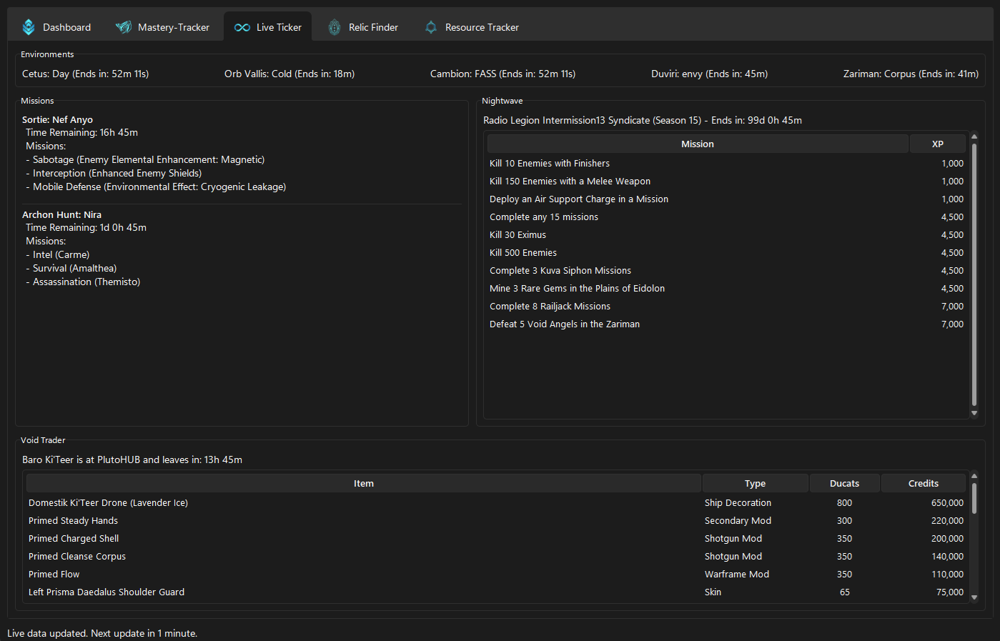

# Warframe Mastery Dashboard

 <!-- Replace this with a link to a good screenshot of your app's dashboard -->

A comprehensive, local desktop application for tracking your Warframe mastery progress, live game events, and resource requirements. Built with Python and Tkinter for a native cross-platform experience.

This application fetches all necessary data from official and community-maintained sources, stores it in a local database, and provides a powerful and responsive interface to manage and view your progress towards mastering every item in Warframe.

## Features

-   **📊 Interactive Dashboard:**
    -   Calculates and displays your current Mastery Rank and progress to the next rank.
    -   Visualizes your overall item status with a donut chart (Mastered, Built, Missing, etc.).
    -   Shows a breakdown of your Mastery XP progress by category with an animated bar chart.

-   **📝 Detailed Mastery-Tracker:**
    -   Browse all masterable items across every category (Warframes, Weapons, Companions, Vehicles, Amps, Necramechs).
    -   Track the Star Chart, including Steel Path completion.
    -   Update item status with a double-click, right-click context menu, or keyboard shortcuts (`m` for Mastered, `s` for Missing, etc.).
    -   Persistent column sorting that remains even after updating item statuses.
    -   Powerful search and filtering options (Hide Mastered, Hide Primes).
    -   Context-aware UI that adapts filters and detail views for different categories.


-   **🌐 Live Ticker:**
    -   Real-time status of Cetus, Orb Vallis, and the Cambion Drift.
    -   Current Sortie and Archon Hunt missions and modifiers.
    -   Active Nightwave challenges with reputation rewards.
    -   Void Trader (Baro Ki'Teer) inventory, location, and arrival/departure times.


-   **🔍 Relic Finder:**
    -   Search all Void Relics and see their rewards with drop chances.
    -   View detailed drop locations for any available (non-vaulted) relic.
    -   Accurate "Vaulted" status based on current drop tables.
    -   Custom-themed text colors for reward rarities.

-   **⚙️ Smart Resource Tracker:**
    -   Calculates a complete list of all base resources required for your "Missing" items.
    -   Also calculates a list of resources you have already "Spent" on your "Mastered" items.
    -   Intelligent filtering to exclude crafted weapon/Warframe components (e.g., Barrels, Chassis) and focus only on farmable resources.
    -   Live search to quickly find a specific resource.
    -   Right-click context menu to instantly find drop locations or open the wiki page for any resource.

-   **🚀 Performance & Usability:**
    -   Proactive image caching for fast and offline viewing of item and planet images.
    -   Dark theme support via `sv-ttk`.
    -   Standard keyboard shortcuts like `Ctrl+A` (Select All) and `Ctrl+C` (Copy Names).

## Getting Started

Follow these steps to get the application running on your local machine.

### Prerequisites

-   Python 3.8 or newer.
-   `pip` (Python's package installer).

### Installation

1.  **Download wftracker.py:**


4.  **Run the application:**
    ```sh
    python wftracker.py
    ```

### First Time Setup
On the very first launch, the application will detect an empty database. It will automatically download all necessary item, node, relic, and recipe data from online sources and populate the local database (`warframe_data.db`). This process may take a minute or two. The status bar at the bottom will show the progress. Subsequent launches will be much faster.

## Usage

-   **Dashboard:** Your main overview. Click "Refresh Charts" to update the visuals after making changes.
-   **Mastery-Tracker:**
    -   Click any category on the left to filter the list.
    -   Double-click an item to toggle its status between "Mastered" and "Missing".
    -   Right-click one or more items to set a specific status or open the Warframe Wiki page.
    -   Use the search bar to filter the list by name.
-   **Resource Tracker:**
    -   This tab automatically calculates required resources when you switch to it.
    -   Right-click any resource to find its drop locations (which will be shown in the Mastery-Tracker tab) or open its wiki page.

## Data Sources

This application would not be possible without the amazing work of the Warframe community. All data is sourced from the following projects:

-   **[WFCD (Warframe Community Developers)](https://github.com/WFCD/warframe-items/):** Provides the comprehensive `All.json` file for item data.
-   **[warframestat.us](https://docs.warframestat.us/):** Provides the API for all live game state data (world cycles, sorties, traders, etc.).
-   **[Warframe Wiki](https://wiki.warframe.com/):** The primary source for images and the target for all "Open in Wiki" actions.

## License

This project is licensed under the MIT License - see the `LICENSE` file for details.
